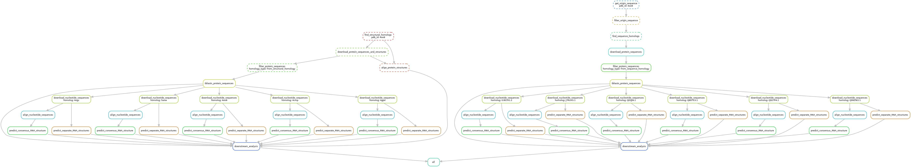

# RNAnalyze

> short description (TODO)

## About

longer description (TODO)



## Setup

### Prerequisites

- [Git](https://git-scm.com/)
- [Conda](https://docs.conda.io/en/latest/miniconda.html)

### Installation

Paste this into your terminal:

```
git clone https://github.com/f1lem0n/RNAnalyze
cd RNAanalyze
conda env create -f environment.yml
```

## Usage

### Basic usage

1. Activate conda environment `conda activate RNAnalyze`
2. Edit `resources/list.txt` to include your proteins of interest
3. Run `snakemake --profile config`

### Configuration

You can change snakemake run parameters by editing `config/config.yaml` file.
The ones which are not supposed to be changed are marked as such.
Read more about snakemake profiles
[here](https://snakemake.readthedocs.io/en/stable/executing/cli.html#profiles).

To change workflow parameters, edit `config/params.yaml` file.
Each parameter is described below.

- `email[="your@email.com"]` Your email address,
  used for Biopython Entrez API and workflow notifications
- `send_email[=False]` Whether to send email notifications
- `USalign` Please refer to
  [USalign github page](https://github.com/pylelab/USalign/tree/master)
  for more information
  - `split[=0]` Whether to split PDB file into multiple chains \
    0: treat the whole structure as one single chain \
    1: treat each MODEL as a separate chain \
    2: (default) treat each chain as a separate chain
  - `full[="T"]` Whether to show full pairwise alignment of individual chains
    for -mm 2 or 4.
- `tblastn`
  - `matrix[="BLOSUM62"]` Scoring matrix
  - `evalue[=1e-20]` E-value threshold for tblastn
  - `max_target_seqs[=10]` Maximum number of target sequences
  - `word_size[=6]` Word size for initial match. Valid word sizes are 2-7.
  - `additional_args[=""]` Additional arguments for tblastn
    (refer to [BLAST+ manual](https://www.ncbi.nlm.nih.gov/books/NBK279690/))
- `split_long_nucleotide_sequences` Set either one below to
  the negative value to turn off this feature
  - `threshold[=1000]` Minimum length of a sequence which will be split into
    chunks. If negative, no sequences will be split.
  - `chunk_size[=1000]` Length of a sequence chunk (if splitting is enabled).
    If negative, no sequences will be split.
- `RNAfold[="-p -r -d2 --noLP --color --aln"]` RNAfold arguments
  (refer to [RNAfold manual](https://www.tbi.univie.ac.at/RNA/RNAfold.1.html))
- `RNAalifold[="-p -r -d2 --noLP --color --aln"]` RNAalifold arguments
  (refer to [RNAalifold manual](https://www.tbi.univie.ac.at/RNA/RNAalifold.1.html))
- `plots`
  - `dpi[=300]` DPI of the plots

## References

Altschul, S. F., Gish, W., Miller, W., Myers, E. W., & Lipman, D. J. (1990). Basic local alignment search tool. Journal of Molecular Biology, 215(3), 403–410. https://doi.org/10.1016/S0022-2836(05)80360-2

  Berman, H. M. (2000). The Protein Data Bank. Nucleic Acids Research, 28(1), 235–242. https://doi.org/10.1093/nar/28.1.235

  Burley, S. K., Bhikadiya, C., Bi, C., Bittrich, S., Chao, H., Chen, L., Craig, P. A., Crichlow, G. v, Dalenberg, K., Duarte, J. M., Dutta, S., Fayazi, M., Feng, Z., Flatt, J. W., Ganesan, S., Ghosh, S., Goodsell, D. S., Green, R. K., Guranovic, V., … Zardecki, C. (2023). RCSB Protein Data Bank (RCSB.org): delivery of experimentally-determined PDB structures alongside one million computed structure models of proteins from artificial intelligence/machine learning. Nucleic Acids Research, 51(D1), D488–D508. https://doi.org/10.1093/nar/gkac1077

  Camacho, C., Coulouris, G., Avagyan, V., Ma, N., Papadopoulos, J., Bealer, K., & Madden, T. L. (2009). BLAST+: architecture and applications. BMC Bioinformatics, 10(1), 421. https://doi.org/10.1186/1471-2105-10-421

  Chandonia, J.-M., Guan, L., Lin, S., Yu, C., Fox, N. K., & Brenner, S. E. (2022). SCOPe: improvements to the structural classification of proteins – extended database to facilitate variant interpretation and machine learning. Nucleic Acids Research, 50(D1), D553–D559. https://doi.org/10.1093/nar/gkab1054

  Fox, N. K., Brenner, S. E., & Chandonia, J.-M. (2014). SCOPe: Structural Classification of Proteins—extended, integrating SCOP and ASTRAL data and classification of new structures. Nucleic Acids Research, 42(D1), D304–D309. https://doi.org/10.1093/nar/gkt1240

  Larkin, M. A., Blackshields, G., Brown, N. P., Chenna, R., McGettigan, P. A., McWilliam, H., Valentin, F., Wallace, I. M., Wilm, A., Lopez, R., Thompson, J. D., Gibson, T. J., & Higgins, D. G. (2007). Clustal W and Clustal X version 2.0. Bioinformatics, 23(21), 2947–2948. https://doi.org/10.1093/bioinformatics/btm404

  Lorenz, R., Bernhart, S. H., Höner Zu Siederdissen, C., Tafer, H., Flamm, C., Stadler, P. F., & Hofacker, I. L. (2011). ViennaRNA Package 2.0. http://www.tbi.univie.ac.at/RNA.

  Mölder, F., Jablonski, K. P., Letcher, B., Hall, M. B., Tomkins-Tinch, C. H., Sochat, V., Forster, J., Lee, S., Twardziok, S. O., Kanitz, A., Wilm, A., Holtgrewe, M., Rahmann, S., Nahnsen, S., & Köster, J. (2021). Sustainable data analysis with Snakemake. F1000Research, 10, 33. https://doi.org/10.12688/f1000research.29032.1

  Sayers, E. W., Bolton, E. E., Brister, J. R., Canese, K., Chan, J., Comeau, D. C., Connor, R., Funk, K., Kelly, C., Kim, S., Madej, T., Marchler-Bauer, A., Lanczycki, C., Lathrop, S., Lu, Z., Thibaud-Nissen, F., Murphy, T., Phan, L., Skripchenko, Y., … Sherry, S. T. (2022). Database resources of the national center for biotechnology information. Nucleic Acids Research, 50(D1), D20–D26. https://doi.org/10.1093/nar/gkab1112

  Zhang, C., Shine, M., Pyle, A. M., & Zhang, Y. (2022). US-align: universal structure alignments of proteins, nucleic acids, and macromolecular complexes. Nature Methods, 19(9), 1109–1115. https://doi.org/10.1038/s41592-022-01585-1